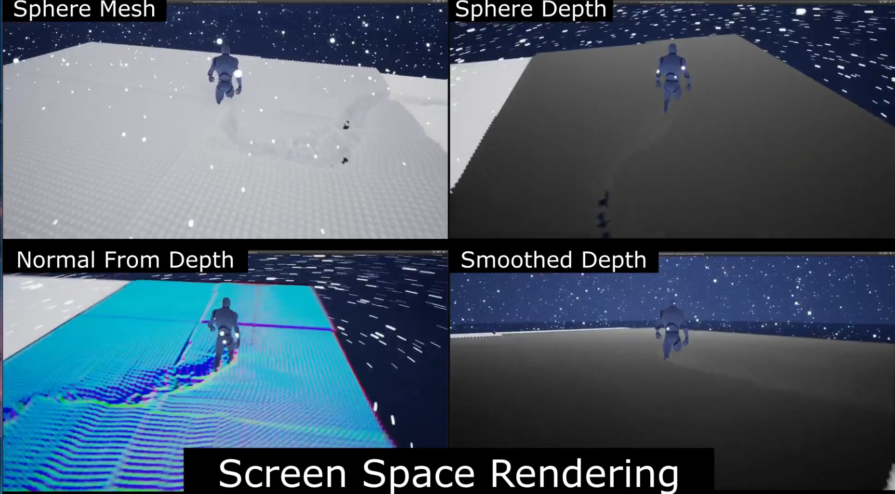

# Real Time Snow Simulation

## 프로젝트 개요
2022년 2학기 소프트웨어 융합학과 게임공학 수업 텀프로젝트  
개발기간 : (2022'04'17) ~ (2022'06'15)    
개발도구 : UE4 4.27.2, CUDA 11.6, C++  
협업방식 : AWS + Perforce(p4v)  
팀원 :  
-[강수한](https://github.com/tngksdlstk12)  
-[원종서](https://github.com/CodeNakWon)    
-[박경숙](https://github.com/Tuesberry)    
-[윤태웅](https://github.com/yuntaewoong)    
-[안해영](https://github.com/anhaeyeong)

## Contribution - 원종서
* CUDA UE4간 인터페이스 구현
* GPU based FRNN 알고리즘 구현
* [Real Time Particle Based Snow Simulation On GPU]를 참고하여 Cohesion Force 기반의 눈 시뮬레이션을 병렬컴퓨팅으로 구현
* Material과 Custom Shader를 통한 Screen Space Rendering 구현    

### 작성코드    
CUDA  
> [SnowCuda.cu](./RealTimeSnowSimulationCUDA/SnowCuda.cu)    
> [SnowCuda.h](./RealTimeSnowSimulationCUDA/header/SnowCuda.h)    
> [Common.cuh](./RealTimeSnowSimulationCUDA/header/Common.cuh)   
> [CohesionForce.cuh](./RealTimeSnowSimulationCUDA/header/CohesionForce.cuh)    
> [Friction.cuh](./RealTimeSnowSimulationCUDA/header/Friction.cuh)    
> [MoveParticle.cuh](./RealTimeSnowSimulationCUDA/header/MoveParticle.cuh)    
> [InitParticle.cuh](./RealTimeSnowSimulationCUDA/header/InitParticle.cuh)  
> [CountNeighbor.cuh](./RealTimeSnowSimulationCUDA/header/CountNeighbor.cuh)    
> [FRNN.cuh](./RealTimeSnowSimulationCUDA/header/FRNN.cuh)   

UE4
> [SnowActorCpp.cpp](./RealTimeSnowUE/Source/RealTimeSnowUE/SnowActorCpp.cpp)    
> [SnowActorCpp.h](./RealTimeSnowUE/Source/RealTimeSnowUE/SnowActorCpp.h)    

## 프로젝트 소개
CUDA와 언리얼을 이용해서 실시간 눈 시뮬레이션 구현  
[소개 유튜브 영상](https://www.youtube.com/watch?v=Uq0_VH8rX-c&t=10s)

### 눈 시뮬레이션

[Real Time Particle Based Snow Simulation On GPU](https://www.diva-portal.org/smash/get/diva2:1320769/FULLTEXT01.pdf)  

논문을 참조하여 ue4 상에서 gpu-based particle simulation구현
### Boundary Condition

Dem모델을 사용해서 충돌처리 구현

### Screen Space Rendering

Screen Space Rendering기술로 particle들의 시각화 구현

### FrameRate

구역별 시뮬레이션으로 적절한 FPS확보(3070ti기준)

## Installation
* `git clone [레포지토리 주소]` 로 프로젝트 Clone
* `RealTimeSnowSimulationCUDA/RealTimeSnowSimulationCUDA.vcxproj` 파일을 `visual studio 2022`프로그램으로 실행
* 빌드모드를 `Release/x64`로 수정후 프로젝트 빌드
* `RealTimeSnowUE/RealTimeSnowUE.uproject` 파일을 `Unreal Engine 4.27.2`프로그램으로 실행  

## 프로그램 실행 조건
* 본 프로젝트는 CUDA11.6 + UE 4.27.2로 개발하였으므로 두 프로그램이 미리 설치되어 있어야 함
* CUDA를 실행할 수 있는 GPU가 달린 PC로 실행해야함 -> [CUDA호환 gpu 리스트](https://developer.nvidia.com/cuda-gpus#compute)  

## 조작 방식
* 마우스(캐릭터 시점 조절)
* wasd(캐릭터 이동)
* `p` : test map에서 시뮬레이션 시작 버튼(test map은 실행 후 20초 뒤부터 눈 시뮬레이션 동작가능)

## Reference
[Real Time Particle Based Snow Simulation On GPU](https://www.diva-portal.org/smash/get/diva2:1320769/FULLTEXT01.pdf)  

[Screen Space Rendering](https://developer.download.nvidia.com/presentations/2010/gdc/Direct3D_Effects.pdf)  

[Fixed Radius Nearest Neighbours](https://on-demand.gputechconf.com/gtc/2014/presentations/S4117-fast-fixed-radius-nearest-neighbor-gpu.pdf)  
